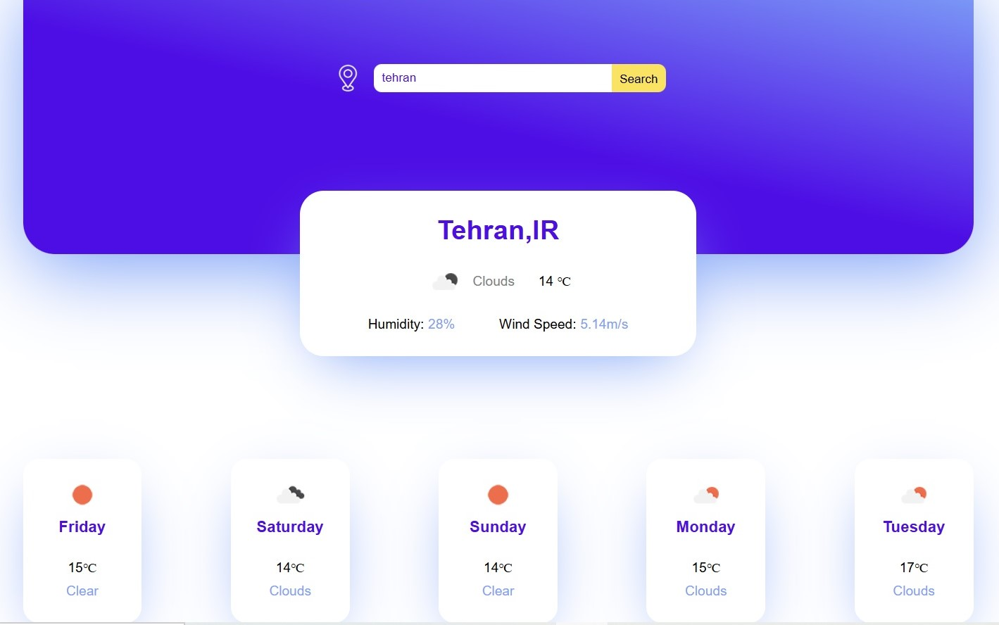

# Weather App with javascript

A simple weather application that shows current weather and 5-day forecast using the OpenWeatherMap API.  
You can search by city name or get the weather based on your current location.

---

## 🌤 Features
- Current weather (temperature, humidity, wind)
- 5-day weather forecast
- City search
- Geolocation support

---

## 🖼 Screenshot

---

## 🚀 How to Run

1. Clone the project:
